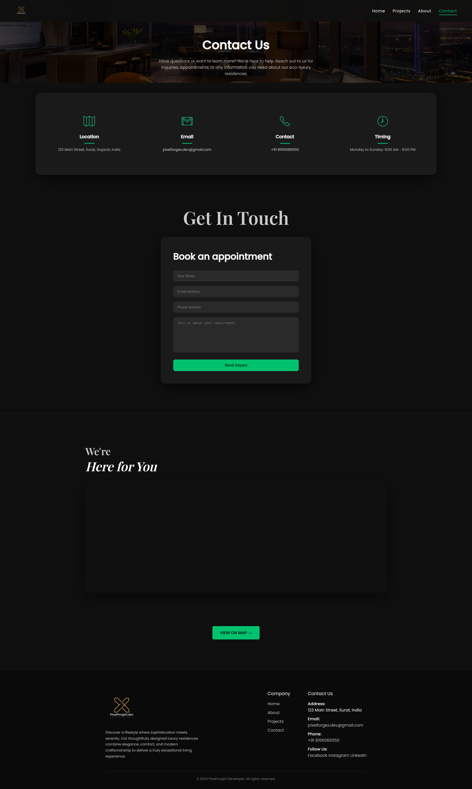

# 🌿 Green Developer Website

A modern, luxury real estate website designed for eco-friendly residential projects in Surat.

## 🚀 Live Preview

👉 [PixelForgeX Developer](https://pixelforgex-developer.vercel.app/)

## 📌 Features

* Luxury hero section with background image
* Modern transparent navbar
* Featured project cards with hover effects
* Amenities section
* About section
* Contact & WhatsApp integration
* Fully responsive design

## 🛠 Tech Stack

* HTML5
* CSS3
* JavaScript

## 📷 Screenshots

### 🏠 Home Page

---

### 🏢 Projects Page

---

### ℹ️ About Page

---

### 📞 Contact Page

## 📁 Folder Structure

* /demo → Main website files
* /pages → Additional pages
* /Logo → Branding assets

## 👨‍💻 Developed By

### Dhruvin Parmar

PixelForgeX.dev

## 📞 Contact

* Instagram: @pixelforgex.dev
* Email: [pixelforgex.dev@gmail.com](mailto:pixelforgex.dev@gmail.com)

---

⭐ If you like this project, feel free to star the repo!
